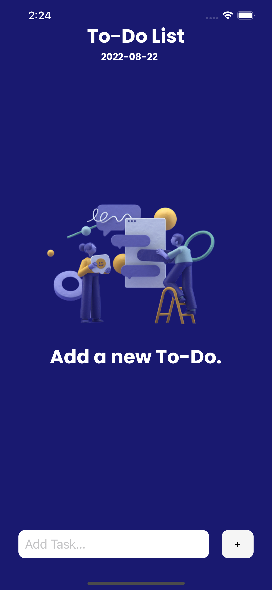

# ToDo List - React Native
<!--  -->
<p align="center">
    
</p>

## What's all about?

Simple React Native app that I wrote to learn about React Native and what can be done with it.

It's a simple implementation that let's you add new tasks and allows you to delete the tasks.

The main App.js feeds from 4 Components:

- Header.js: the header of the ToDo List app and the current date.
- Empty.js: which will be displayed when the ToDo List is empty.
- AddInput.js: logic to add new items to the ToDo List.
- TodoList.js: logic on how to display/organise the items in the ToDo List.

Then, it's all made to work together in the App.js file.

If you would like to try out this React Native app, clone this repository locally:

## Installation:

This projects uses Expo, so you'll need to have Expo installed in your computer (https://docs.expo.dev/get-started/installation/)

1. Clone this repository in your computer:
```
git clone https://github.com/JeanFerreira91/todo-list.git
cd todo-list
```

2. Install the packages/dependencies:
```
yarn install
npx expo install
```

Last, run it:

```
npx expo start
```